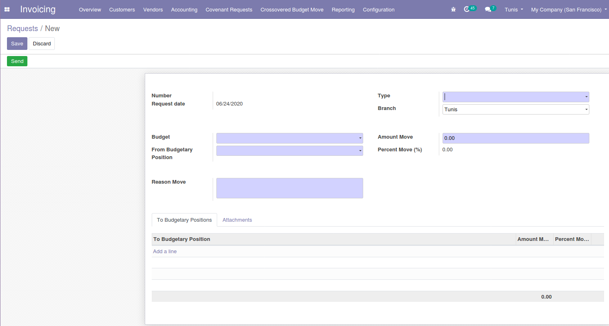

# Account Budget Move

This module allows to transfers between budget items.

**Table of contents**

- [Overview](#overview)
- [Usage](#usage)
- [Bug Tracker](#bug-tracker)
- [Maintainer](#maintainer)

## Overview

## Usage

- Transfers are made between budget items.
- Transfer amount from one item to another in case of a shortage of one of the item and abundance in another items.
- This module allow to:
  - Add/Modify Crossovered Budget Move Requests.

## Bug Tracker

Bugs are tracked on [Gitlab Issues](https://gitlab.com/hadooc/odoo-sa/account/-/issues).

In case of trouble, please check there if your issue has already been reported. If you spotted it first, help us smash
it by providing detailed and welcomed feedback.

## Maintainer

This module is maintained by Hadooc.

To contribute to this module, please visit [Contributing Page](https://gitlab.com/hadooc/extra/wikis/Contributing).
