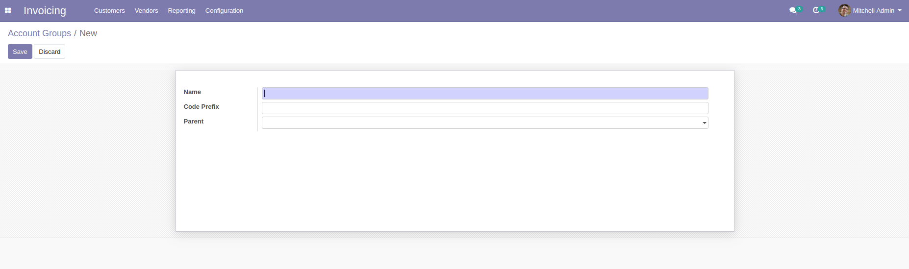

# Account Group

Display groups and add possibility to add groups.

**Table of contents**

- [Overview](#overview)
- [Configuration](#configuration)
- [Usage](#usage)
- [Bug Tracker](#bug-tracker)
- [Maintainer](#maintainer)

## Overview

#### Adding Account Group :

- The menu "Groups" allows you to manage account groups

- The user can add a group account by the following steps :

1. Going to Invoices -> Configuration -> Groups Click on button "Create"
2. add details of Account group :

## Configuration

You don't need a specific configuration.

## Usage

## Bug Tracker

Bugs are tracked on
[Gitlab Issues](https://gitlab.com/hadooc/odoo/account/issues)

In case of trouble, please check there if your issue has already been reported.
If you spotted it first, help us smash it by providing detailed and welcomed
feedback.

## Maintainer

This module is maintained by Hadooc.

To contribute to this module, please visit
[Contributing Page](https://gitlab.com/hadooc/extra/wikis/Contributing).
