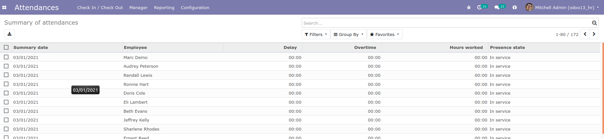

# Attendance Summary

This module allows creating summary of attendance for every employee

**Table of contents**

- [Overview](#overview)
  - [Create new summary](#create-new-summary)
- [Configuration](#configuration)
- [Bug Tracker](#bug-tracker)
- [Maintainer](#maintainer)

## Overview

#### Create new summary

Go to Attendances -> Manager -> Summary of attendances

- There is a cron named "Create summary for employees", and it called every day at 00:00. when the cron is running,
  summaries will be created for every employee according to his calendar attendance. If the employee has leave the state
  of presence of summary created will be "On leave" else by default "In service".

- If a leave has been confirmed and there is a summary already created with presence state is "In service", then the
  state of presence summary will be "On leave".

## Configuration

You don't need a specific configuration.

## Bug Tracker

Bugs are tracked on [Gitlab Issues](https://gitlab.com/hadooc/odoo/hr/-/issues)

In case of trouble, please check there if your issue has already been reported. If you spotted it first, help us smash
it by providing detailed and welcomed feedback.

## Maintainer

This module is maintained by Hadooc.

To contribute to this module, please visit [Contributing Page](https://gitlab.com/hadooc/extra/wikis/Contributing).
