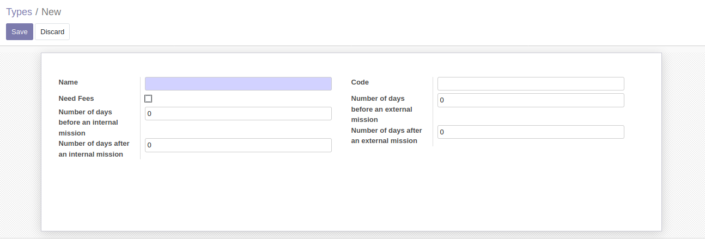
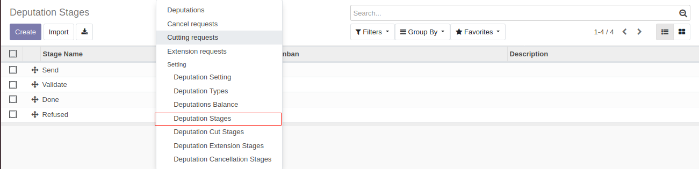
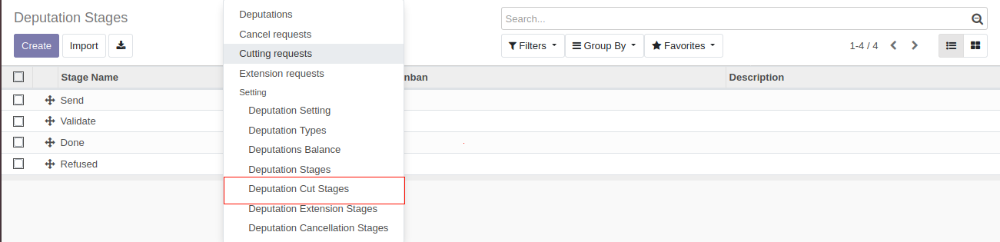
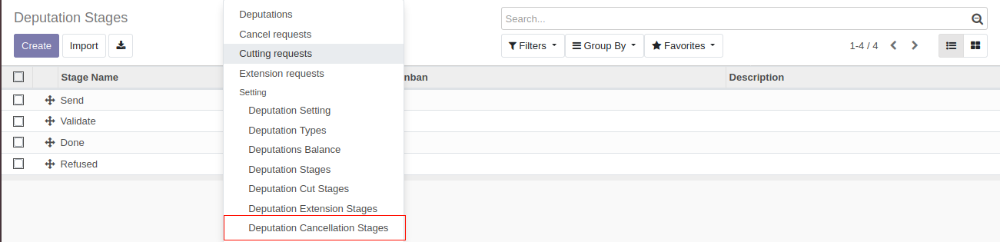
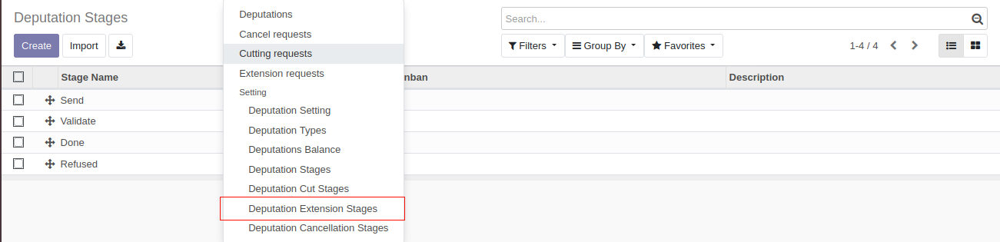
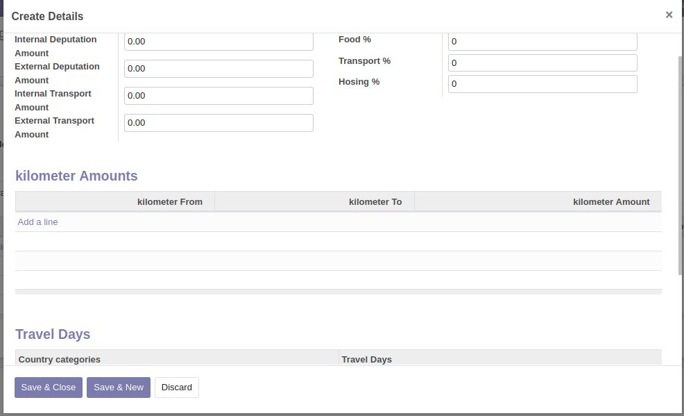
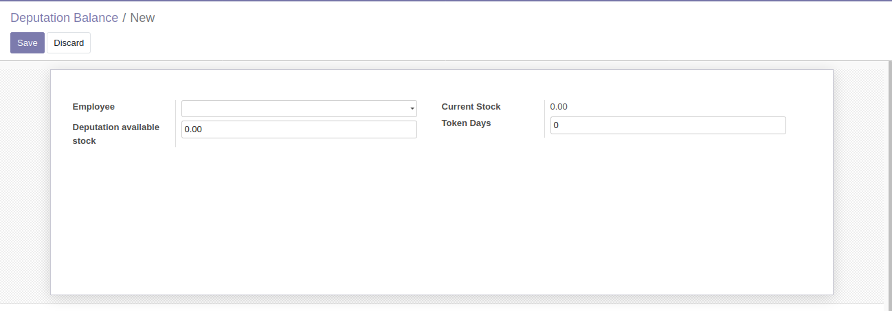
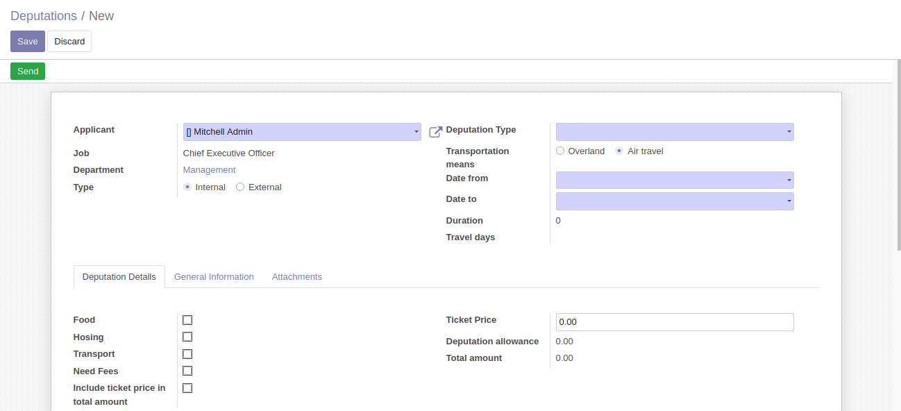

# Deputation Management

Using this module you can manage deputation requests. This modules allows to all employees to send or cut or cancel or
extend a deputation request.

**Table of contents**

- [Overview](#overview)
  - [Adding Deputation Types](#adding-deputation-types)
  - [Adding Stages](#adding-stages)
  - [Configure Deputation Setting](#updating-deputation-setting)
  - [Add Employee Deputation Balance](#add-employee-deputation-balance)
- [Configuration](#configuration)
- [Usage](#usage)
- [Bug Tracker](#bug-tracker)
- [Maintainer](#maintainer)

## Overview

#### Adding Deputation Types

The manager of deputation can add a new type using the following steps :

1. Go to Deputations -> Configuration -> Deputation Types
2. Create a deputation type.

#### Adding Deputation stages:

Deputation Stages means the differents steps that the request should follow to be done. User who have the group Manage
Stages can:

Add a new deputation stage by :

1. Going to Deputations -> Configuration -> Deputation Stages
2. Create Deputation Stage :

Add a new deputation cut stage by :

1. Going to Deputations -> Configuration -> Deputation Cut Stages
2. Create Deputation Cut Stage :

Add a new deputation cancellation stage by :

1. Going to Deputations -> Configuration -> Deputation Cancellation Stages
2. Create Deputation Cancellation Stage :

Add a new deputation extension Stage by :

1. Going to Deputations -> Configuration -> Deputation Extension Stages
2. Create Deputation Extension Stage :

### Configure Deputation Setting

The manager of deputation can configure deputation setting by:

- Add internal deputation amount and external deputation amount
- Add kilometer Amounts
- Add travel days

### Add Employee Deputation Balance

The manager of deputation can add balance of deputation to employee.

Add a new balance to employee:

1. Going to Deputations -> Configuration -> Deputation Balance
2. Create New Balance :

## Configuration

You should add types and stages before create a deputation and add balance to employees.

## Usage

- This module allow to manage:

  - Deputation Requests.
  - Deputation Cut Requests.
  - Deputation Extension Requests.
  - Deputation Cancellation Requests.

An employee can create a deputation from the menu Self services.

## Bug Tracker

Bugs are tracked on [Gitlab Issues](https://gitlab.com/hadooc/odoo-sa/hr/issues)

In case of trouble, please check there if your issue has already been reported. If you spotted it first, help us smash
it by providing detailed and welcomed feedback.

## Maintainer

This module is maintained by Hadooc.

To contribute to this module, please visit [Contributing Page](https://gitlab.com/hadooc/extra/wikis/Contributing).
