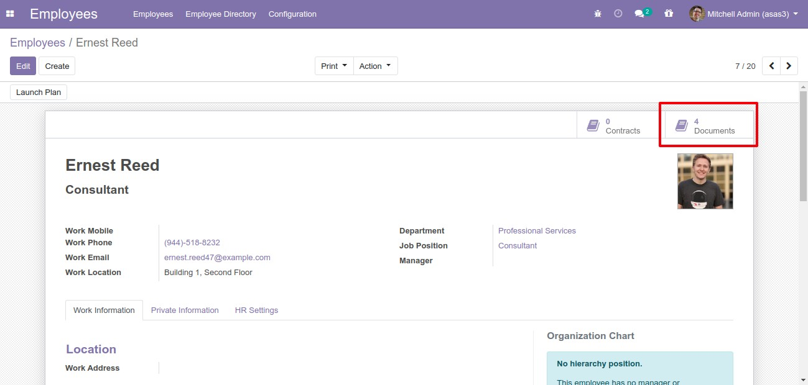

# HR Employee Document

This module allows to attach documents to the employee profile.

**Table of contents**

- [Overview](#overview)
  - [Add new document](#add-new-document)
- [Configuration](#configuration)
- [Bug Tracker](#bug-tracker)
- [Maintainer](#maintainer)

## Overview

#### Add new document

Go to Employees -> Create

## Configuration

You don't need a specific configuration.

## Bug Tracker

Bugs are tracked on [Gitlab Issues](https://gitlab.com/hadooc/odoo/hr/-/issues)

In case of trouble, please check there if your issue has already been reported. If you spotted it first, help us smash
it by providing detailed and welcomed feedback.

## Maintainer

This module is maintained by Hadooc.

To contribute to this module, please visit [Contributing Page](https://gitlab.com/hadooc/extra/wikis/Contributing).
