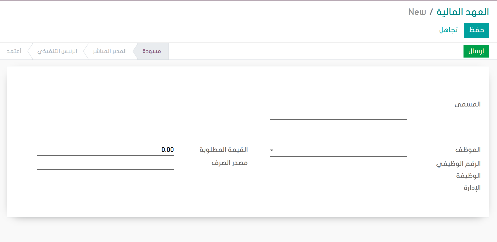

# HR Financial Covenant

-This module allows to manage:

-Financial Covenant Requests.

-Financial Covenant Requests Stages.

**Table of contents**

- [Overview](#overview)
- [Adding Fields](#adding-fields)
- [Configuration](#configuration)
- [Usage](#usage)
- [Bug Tracker](#bug-tracker)
- [Maintainer](#maintainer)

## Overview

To create new financial covenant request go to employee --> Financial Covenants --> Financial Covenants

## Usage

## Bug Tracker

Bugs are tracked on [Gitlab Issues](https://gitlab.com/hadooc/odoo-sa/hr/issues)

In case of trouble, please check there if your issue has already been reported. If you spotted it first, help us smash
it by providing detailed and welcomed feedback.

## Maintainer

This module is maintained by Hadooc.

To contribute to this module, please visit [Contributing Page](https://gitlab.com/hadooc/extra/wikis/Contributing).
