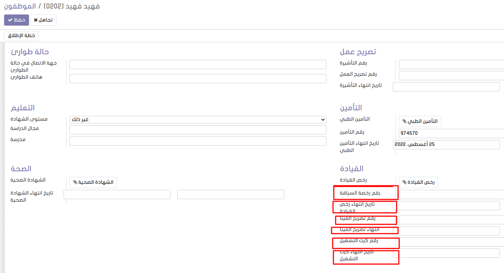
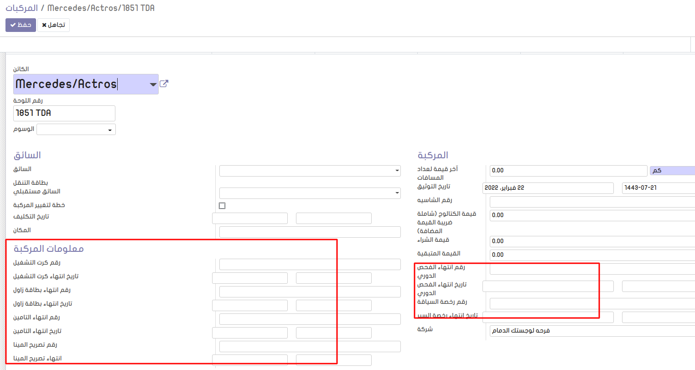

# Hr Fleet Information

Add information of module fleet

**Table of contents**

- [Overview](#Overview)
- [Configuration](#configuration)
- [Usage](#usage)
- [Bug Tracker](#bug-tracker)
- [Maintainer](#maintainer)

## Overview

-This module allows you to add fields for employee and vehicle.

## Configuration

You don't need a specific configuration.

## Usage

## Bug Tracker

Bugs are tracked on [Gitlab Issues](https://gitlab.com/hadooc/odoo-sa/fleet/issues)

In case of trouble, please check there if your issue has already been reported. If you
spotted it first, help us smash it by providing detailed and welcomed feedback.

## Maintainer

This module is maintained by Hadooc.

To contribute to this module, please visit
[Contributing Page](https://gitlab.com/hadooc/extra/wikis/Contributing).
