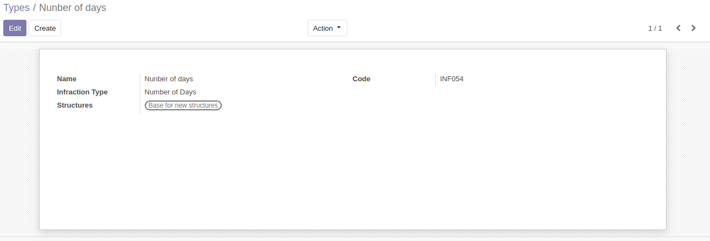
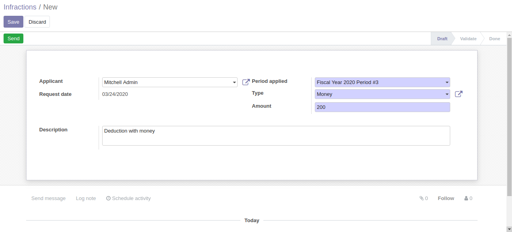
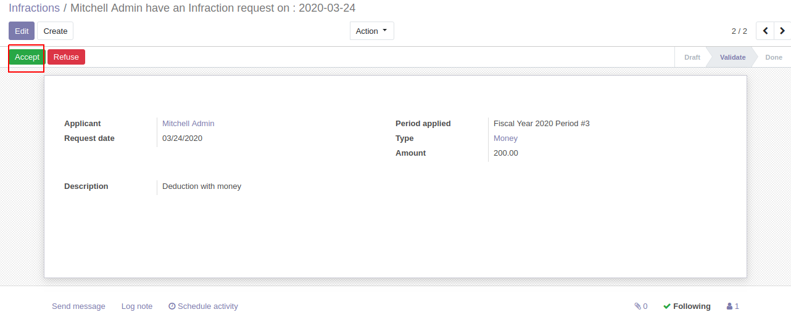

# Employee Infraction Management

This module allows you to make infractions to emloyees.

**Table of contents**

- [Overview](#overview)
  - [Create infraction types](#create-infraction-types)
  - [Adding infractions](#adding-infractions)
  - [validate infractions](#validate-infractions)
- [Configuration](#configuration)
  - [Manage stages](#Manage-stages)
- [Bug Tracker](#bug-tracker)
- [Maintainer](#maintainer)

## Overview

#### Create infraction types

To create Infraction Go Employee -> infractions -> Types.

#### Adding infractions

Infractions are included within hr modules .

1. To add a new infraction go to : Employee -> infractions -> infractions.

   

2. To validate infraction, user needs to have the access right "Infraction Manager" and "Officer of employees", and be
   allowed in the configuration of stages.

   

## Configuration

To manage stages, a manager needs to have the access right of Stages manager.

- Go to Settings -> users & companies select user and check "Manage Stages".

## Bug Tracker

Bugs are tracked on [Gitlab Issues](https://gitlab.com/hadooc/odoo/hr/issues)

In case of trouble, please check there if your issue has already been reported. If you spotted it first, help us smash
it by providing detailed and welcomed feedback.

## Maintainer

This module is maintained by Hadooc.

To contribute to this module, please visit [Contributing Page](https://gitlab.com/hadooc/extra/wikis/Contributing).
