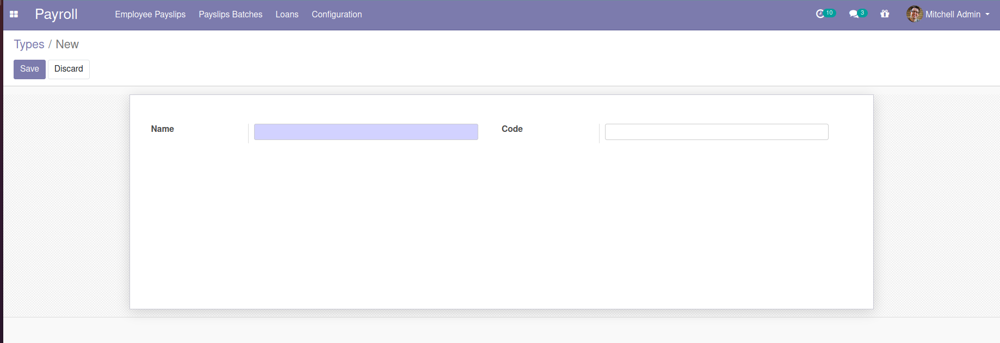
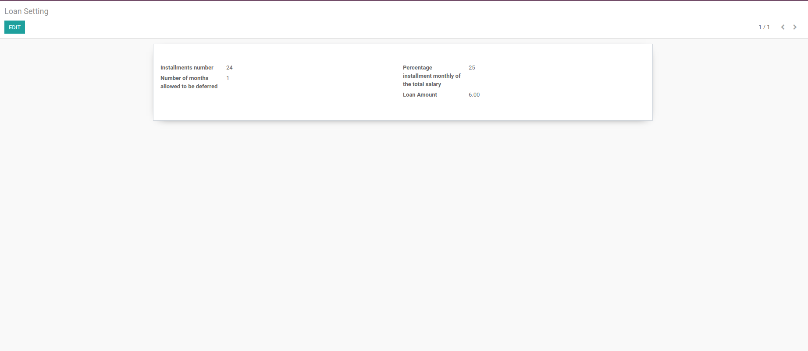
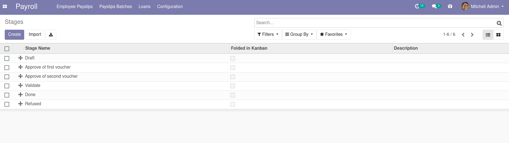
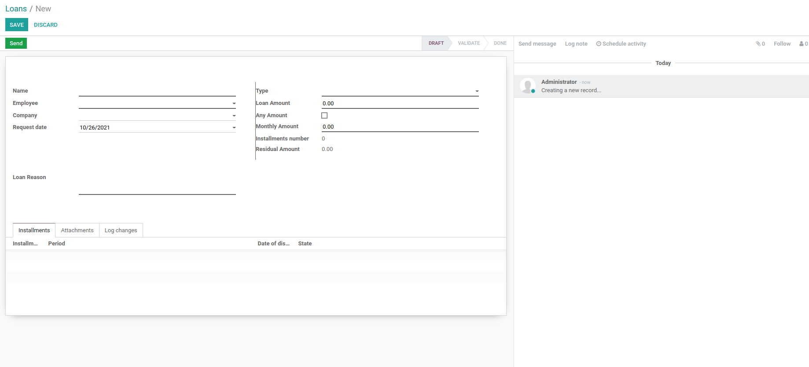

# Payroll Loan

Manage loans

**Table of contents**

- [Overview](#overview)
- [Configuration](#configuration)
- [Bug Tracker](#bug-tracker)
- [Maintainer](#maintainer)
- [Installation](#installation)

## Installation

To install this module, you need to:

- clone the branch 14.0 of the repository.
- add the path to this repository in your configuration (addons-path)
- update the module list
- search for "Payroll Loan" in your addons
- install the module

## Overview

The manager of Loan can add a new Loan type using the following steps :

1. Go to Payroll -> Loans -> Setting-> Loans Types
2. Create a Loans type.

The manager of Loan can edit the Loan setting using the following steps :

1. Go to Payroll -> Loans -> Setting -> Loan Setting
2. Edit Loans Setting.

The manager of Loan can add a Loan stages using the following steps :

1. Go to Payroll -> Loans -> Setting -> Loan stages
2. Create Loans stages.

The manager and the user of Loan can create a Loan request using the following steps :

1. Go to Payroll -> Loans -> Loans
2. Create Loans request.

## Configuration

You don't need a specific configuration.

## Bug Tracker

Bugs are tracked on
[Gitlab Issues](https://gitlab.com/hadooc/odoo/branch/payroll/issues).

In case of trouble, please check there if your issue has already been reported. If you
spotted it first, help us smash it by providing detailed and welcomed feedback.

## Maintainer

This module is maintained by Hadooc.

To contribute to this module, please visit
[Contributing Page](https://gitlab.com/hadooc/extra/wikis/Contributing).
