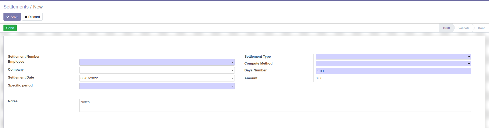
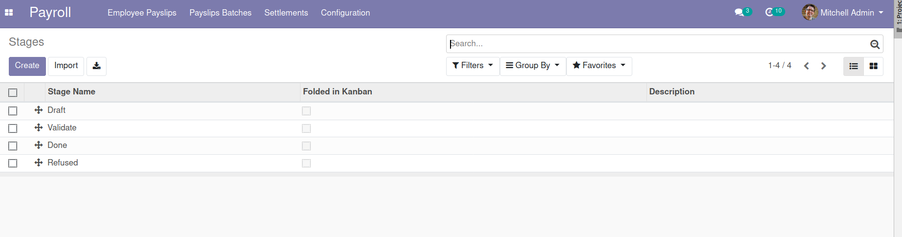

# Payroll Settlement

Manage settlements

**Table of contents**

- [Overview](#overview)
- [Configuration](#configuration)
- [Bug Tracker](#bug-tracker)
- [Maintainer](#maintainer)
- [Installation](#installation)

## Installation

To install this module, you need to:

- clone the branch 13.0 of the repository.
- add the path to this repository in your configuration (addons-path)
- update the module list
- search for "Payroll settlements" in your addons
- install the module

## Overview

The manager and users of settlements can add a new settlements request using the
following steps :

1. Go to Payroll -> settlements -> settlements
2. Create a settlements request.

The manager of settlements can add a settlements stages using the following steps :

1. Go to Payroll -> settlements -> settlements stages
2. Create settlements stages.

## Configuration

You don't need a specific configuration.

## Bug Tracker

Bugs are tracked on
[Gitlab Issues](https://gitlab.com/hadooc/odoo/branch/payroll/issues).

In case of trouble, please check there if your issue has already been reported. If you
spotted it first, help us smash it by providing detailed and welcomed feedback.

## Maintainer

This module is maintained by Hadooc.

To contribute to this module, please visit
[Contributing Page](https://gitlab.com/hadooc/extra/wikis/Contributing).
