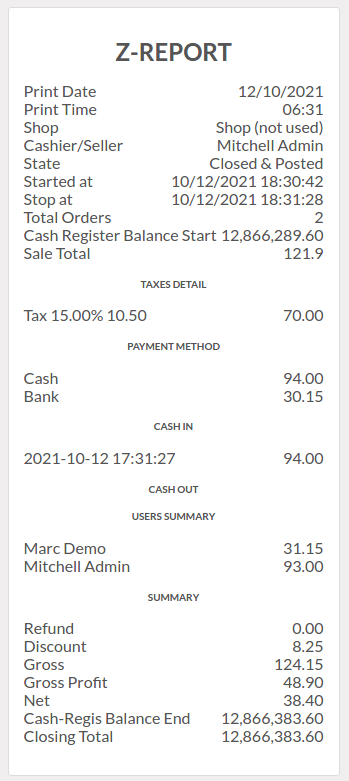

# Pos Cash ATM

This module allows you to add Cash and ATM when closing session or logout from system.

After closing session you can print detailed total sales report

**Table of contents**

- [Overview](#overview)
- [Configuration](#configuration)
- [Bug Tracker](#bug-tracker)
- [Maintainer](#maintainer)

## Overview

#### Add Cash and ATM

The user should add cash or atm before closing session or logout from system.

#### Continue Selling

the user can continue selling.

#### Keep Session

the user can add cash or atm and keep session open.

#### Close Session

the user can add cash or atm before closing session and print report.

#### Close Session/Logout

the user can add cash or atm and logout from system after closing session.

#### Logout System

the user can add cash or atm before logout from system.

## Configuration

You don't need a specific configuration.

## Bug Tracker

Bugs are tracked on [Gitlab Issues](https://gitlab.com/hadooc/odoo-sa/pos/-/issues)

In case of trouble, please check there if your issue has already been reported. If you
spotted it first, help us smash it by providing detailed and welcomed feedback.

## Maintainer

This module is maintained by Hadooc.

To contribute to this module, please visit
[Contributing Page](https://gitlab.com/hadooc/extra/wikis/Contributing).
