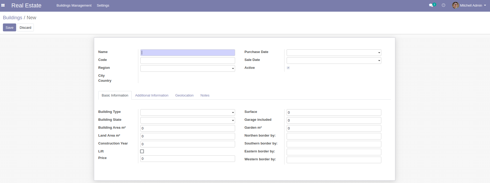
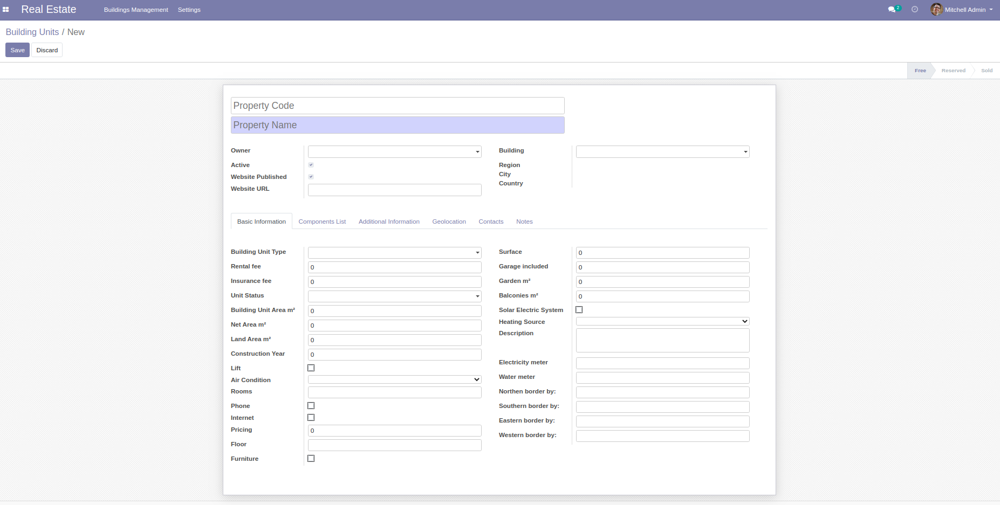

# Real Estate

This modules allows to Manage Real Estates.

## Table of contents

- [Overview](#overview)
  - [Adding building](#adding-building)
  - [Adding building unit](#adding-building-unit)
- [Configuration](#configuration)
- [Usage](#usage)
- [Bug Tracker](#bug-tracker)
- [Maintainer](#maintainer)

## Overview

#### Adding building :

The user can add a new building by the following steps :

1. Going to Real Estate -> Building Management -> Buildings
2. The system will display the list of buildings :
3. Click in button "Create" and fill the fields of building :

#### Adding building unit :

To add a Building Unit the user should:

1. Go to Menu Real Estate -> Building Management -> Building units
2. The system will display the list of Building units :
3. Click in button "Create" and fill the fields of Building units :

## Configuration

While adding a new Building the user have to add the :

- Building type
- Building state
- Building component
- Building furniture

This details will be used while adding a new building.

## Usage

- This module allow to:
  - Add/Modify Buildings
  - Add/Modify Buildings units

## Bug Tracker

Bugs are tracked on
[Gitlab Issues](https://gitlab.com/hadooc/odoo/real_estate/-/issues).

In case of trouble, please check there if your issue has already been reported. If you
spotted it first, help us smash it by providing detailed and welcomed feedback.

## Maintainer

This module is maintained by Hadooc.

To contribute to this module, please visit
[Contributing Page](https://gitlab.com/hadooc/extra/wikis/Contributing).
